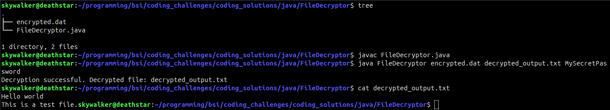

```markdown
# README for File Decryption Utility

**Company:** Brilliant Solutions, Inc.  
**Author:** Alexander La Barge  
**Date:** 7 Apr 25  

---

## Overview

This **File Decryptor** verifies and **decrypts** files created by **FileEncryptor.java**. It:

1. **Reads** salt (16 bytes) and IV (12 bytes) from the beginning of the encrypted file.  
2. **Derives** the same AES key (via PBKDF2) from the user’s password.  
3. **Decrypts** the remaining ciphertext using AES/GCM.  
4. **Writes** the recovered plaintext to a specified output file.

---

## Directory Structure

Below is an example of how the `FileDecryptor` folder might look alongside other directories in your project:

```
skywalker@deathstar:~/programming/bsi/coding_challenges/coding_solutions/java$ tree
.
├── FileDecryptor
│   ├── decrypted_output.txt
│   ├── encrypted.dat
│   ├── FileDecryptor.class
│   └── FileDecryptor.java
├── FileEncryptor
│   ├── encrypted.dat
│   ├── FileEncryptor.class
│   ├── FileEncryptor.java
│   ├── README.md
│   └── sample.txt
├── FileStatsReader
│   ├── FileStatsReader.class
│   ├── FileStatsReader.java
│   ├── README.md
│   └── sample.txt
├── includes
│   ├── FileDecryptor.png
│   ├── FileEncryptor.png
│   └── FileStatsReader.png
└── README.md
```

- **`FileDecryptor.java`**: Source code for the decryptor utility.  
- **`encrypted.dat`**: Encrypted file generated by FileEncryptor (example name).  
- **`decrypted_output.txt`**: Example of a successfully decrypted plaintext file.  
- **`includes/FileDecryptor.png`**: A reference image (screenshot or diagram) for the decryptor utility usage.

---

## Compilation & Usage

### 1. Compile

From **within** the `FileDecryptor` directory:

```bash
cd FileDecryptor
javac FileDecryptor.java
```

### 2. Run

Use three arguments:  
1. **Encrypted File** (e.g., `encrypted.dat`)  
2. **Output File** (e.g., `decrypted_output.txt`)  
3. **Password** (the same used by FileEncryptor)

```bash
java FileDecryptor encrypted.dat decrypted_output.txt MySecretPassword
```

**Expected Output** (if decryption succeeds):
```
Decryption successful. Decrypted file: decrypted_output.txt
```

### Sample Screenshot

Here is a sample screenshot or illustration, located in the **`includes`** directory:



---

## Common Issue & Resolution

If you see an error like:

```
Error: Could not find or load main class FileDecryptor
Caused by: java.lang.NoClassDefFoundError: FileDecryptor (wrong name: FileDecryptor/FileDecryptor)
```

- Ensure **no** `package` declaration exists in `FileDecryptor.java`.  
- Make sure you compile and run it **from the same folder** where `FileDecryptor.java` and its `.class` reside:
  ```bash
  cd FileDecryptor
  javac FileDecryptor.java
  java FileDecryptor encrypted.dat decrypted_output.txt MySecretPassword
  ```

Alternatively, specify the classpath explicitly:

```bash
java -cp . FileDecryptor encrypted.dat decrypted_output.txt MySecretPassword
```

---

## Verification

1. **Check the resulting file** (`decrypted_output.txt`) to confirm it matches your original plaintext (before encryption).  
2. Any mismatch in password or tampering with the encrypted file will typically result in an `AEADBadTagException` or similar decryption error.

---

## Security Notes

- **AES/GCM** provides authenticated encryption.  
- **Salt & IV** are stored **in the first 28 bytes** (`16` for salt + `12` for IV) of the encrypted file.  
- **Never** hardcode passwords in real applications. This example uses direct command-line arguments for demonstration.

---

**Enjoy verifying your encryption with `FileDecryptor.java`!**  
Contact **Alexander La Barge** at Brilliant Solutions, Inc. for questions or support.
```